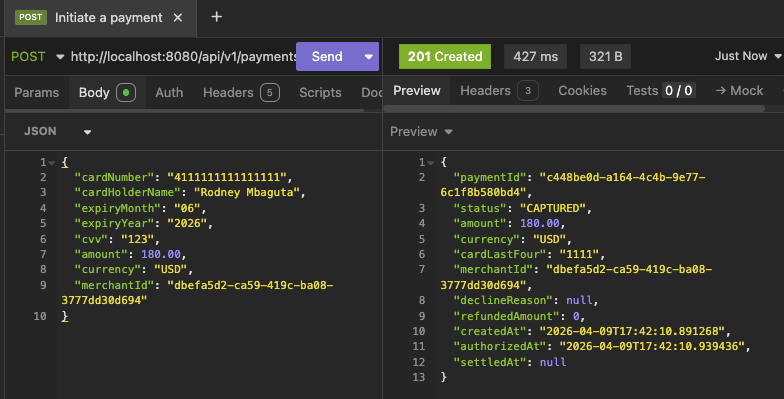
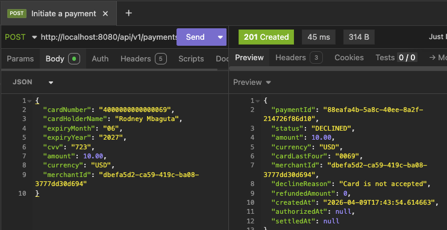
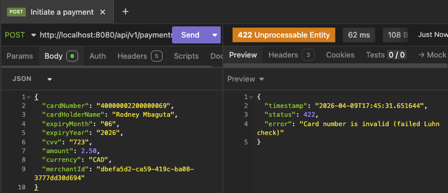
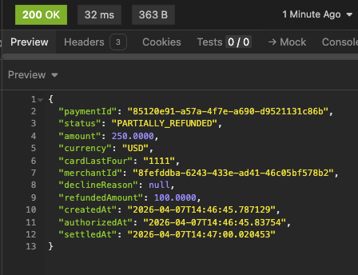
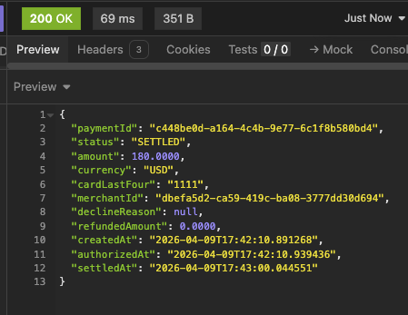
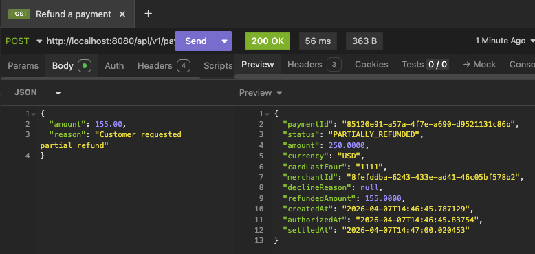
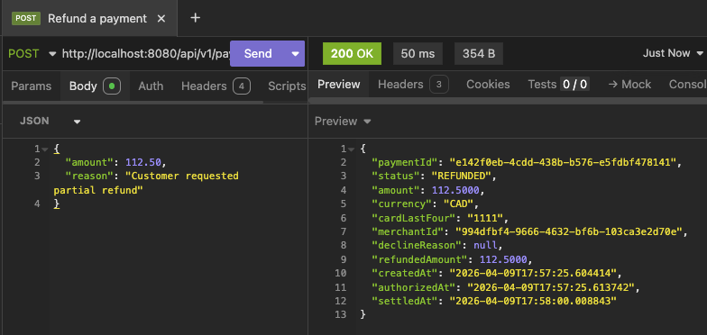
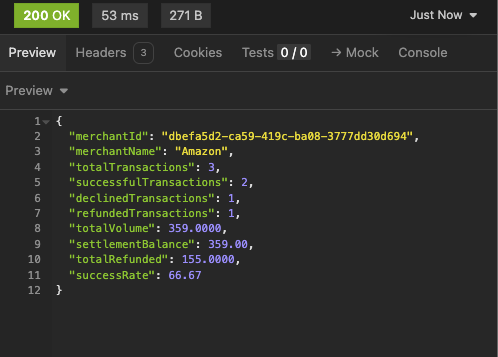
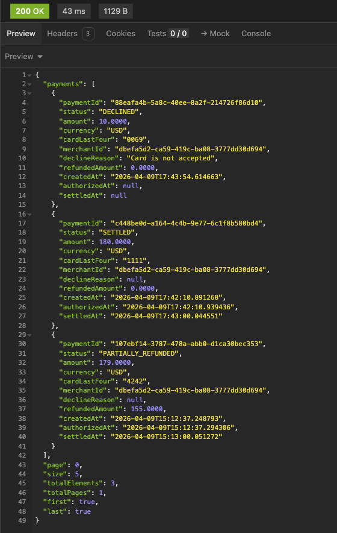
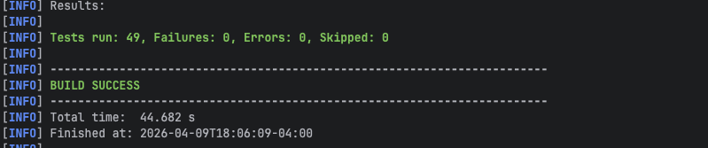

A production-realistic REST API that simulates the end-to-end lifecycle of a payment transaction — from initiation through authorization, capture, settlement, and refund. Built to mirror how real payment gateways (Stripe, Adyen) work internally.

## Tech Stack
- **Language** - Java 21
- **Framework** — SpringBoot 3.5
- **Database** — PostgreSQL
- **ORM** — Spring Data JPA / Hibernate
- **Testing** — JUnit 5, Mockito, Testcontainers
- **Build Tool** — Maven
- - **API documentation** — Swagger / OpenAPI

## Features

- **Card Validation** — Luhn algorithm checksum + expiry date verification
- **Fraud Rule Engine** — blocklist, transaction limits, currency checks, pattern detection
- **Payment Lifecycle** — `PENDING → AUTHORIZED → CAPTURED → SETTLED`
- **Idempotency** — duplicate payment detection via `Idempotency-Key` header (mirrors Stripe)
- **Refunds** — partial and full refunds with remaining balance tracking
- **Batch Settlement** — `@Scheduled` job simulates real T+1 settlement processing
- **Merchant Dashboard** — transaction volume, success rates, settlement balance
- **Pagination & Filtering** — paginated payment history filtered by status

## Payment Flow
1. POST api/v1/payments
   - Idempptency check, card validation, merchant validator, fraud rule engine)
   - Balance check, deduct funds, persist
   @Scheduled job every minute to convert CAPTURED → SETTLED + credit merchant balance
2. POST /api/v1/payments/{id}/refund
   - Status guard
   - Amount guard (cannot exceed original)
   - Restore account balance
   - Status: REFUNDED (for full refunds) and PARTIALLY_REFUNDED (for partial refunds)

## API Endpoints
- POST /api/v1/payments - To initiate a payment
- GET /api/v1/payments{id} - Get payment by ID
- GET /api/v1/payments?merchantId=&page=&size=&sortBy=&direction   -To get paginated oayments for a merchant
- GET /api/v1/payments/status?merchantId=&status=&page=&size=    -To get payments filtered by status
- POST /api/v1/payments/{id}/refund  - To refund a payment
- GET /api/v1/merchants/{id}/summary  -To get a merchant dashbaord summary

## Screenshots
### Successful payment
- Headers: Idempotency-Key: unique-key-001

### Declined payment

### Invalid Card - Luhn check fail

### Get payment by ID

### Settled payment confirmation

### Partial refund

### Full refund

### Merchant dashboard summary

### Paginated payments

### All tests pass
- Run the test: mvn test for both the Unit tests and the Integration Tests
- Unit Test only:  mvn test -Dtest=PaymentServiceTest,  mvn test -Dtest=CardValidatorTest
- Integration Tets Only: mvn test -Dtest=PaymentControllerIntegrationTest

## Future Enhnancements
- Spring Security + JWT: protect all endpoints, add merchant login and issue tokens per merchant.
- Docker: containerize the app and the PostgreSQL database to be able to run the app in one command.
- Rate limiting: limit payment attempts per card per minute using a simple in-memory counter or Redis
